<picture>
  <source media="(prefers-color-scheme: dark)" srcset="assets/header-dark.svg">
  
</picture>

<p align="center">
  <a href="https://portfoliofofackhenri.vercel.app/"></a>
  <a href="https://linkedin.com/in/henri-fofack-250b1b320"></a>
  <a href="mailto:fofackhenri36@gmail.com"></a>
  
</p>

## 👋 About me

- 🎓 5th-year (final-year) Computer Engineering student at the **National Advanced School of Engineering of Yaoundé (ENSPY)**, Cameroon
- 🧠 Generalist engineering background (software, web, IoT) with a strong focus on **Data Science, Machine Learning and Deep Learning**
- 🏆 **6 awards** in hackathons and project competitions, including 2nd place at **IndabaX Cameroon 2026**
- 🌍 French (fluent) · English (intermediate) · German (beginner)
- 📫 Open to internships and collaborations in **Data Science / AI engineering**

<picture>
  <source media="(prefers-color-scheme: dark)" srcset="assets/divider-dark.svg">
  
</picture>

## 🧭 Philosophy

> *A model is only useful once someone can actually use it.*

- 🎯 **Impact over complexity**: I build for real problems such as air quality, access to water and healthcare management.
- 🔍 **Understand before optimizing**: explore the data, question the assumptions, explain the model.
- 🧱 **Ship end-to-end**: from the notebook to the API to the app in someone's hands.
- 🤝 **Build with others**: my best results came from mixed teams, like the ISSEA–ENSPY team behind AirSentinel.

## 🚀 Current journey

```python
class CurrentJourney:
    """What I'm learning and building right now."""

    def __init__(self):
        self.studying = "Computer Engineering @ ENSPY, 5th (final) year"
        self.learning = {
            "deep_learning": ["CNN architectures", "Transformers & attention"],
            "computer_vision": ["Real-time object detection", "Medical image analysis"],
            "llm_engineering": ["Multi-agent systems with LangGraph", "LLM fallback & orchestration"],
            "ml_in_production": ["Serving models with FastAPI", "Docker for ML workflows"],
            "data_science": ["Gradient boosting (XGBoost, LightGBM)", "Explainability with SHAP"],
        }
        self.building = ["AirSentinel", "AVA Pro", "Ophélia"]
        self.open_to = ["Data Science internships", "AI collaborations"]

    def motto(self) -> str:
        return "Never stop learning 📚"


if __name__ == "__main__":
    print(CurrentJourney().motto())
```

<picture>
  <source media="(prefers-color-scheme: dark)" srcset="assets/divider-dark.svg">
  
</picture>

## 🛠️ Featured projects

| Project | What it does | Stack |
|---|---|---|
| 🌍 [**AirSentinel**](https://github.com/ALEMDJOU/AirSentinel2) | Air quality forecasting for 42 Cameroonian cities. 🥈 IndabaX Cameroon 2026. I built the web/mobile app and the prediction API. | XGBoost · LightGBM · SHAP · FastAPI · Next.js |
| 🤖 [**AVA Pro**](https://github.com/ALEMDJOU/Projet3_I3AFD) | Multi-agent system that rates YouTube videos from their comments (spam filtering, sentiment, educational value) with automatic LLM fallback. | LangGraph · Gemini · Qwen · DeepSeek · Streamlit |
| 🧩 [**LeNet vs PCA**](https://github.com/ALEMDJOU/LeNet-ACP) | Comparison of CNN, PCA + dense network and a hybrid CNN + PCA approach on Fashion-MNIST, CPU-only. | TensorFlow · Scikit-learn |
| 📄 [**Ophélia**](https://github.com/ALEMDJOU/DollPhelia) | Dolibarr ERP module that extracts data from invoices and documents with confidence scores and human validation. | Tesseract OCR · LayoutLMv3 · Python · PHP |
| 📚 [**XCCM2**](https://github.com/Git-Tomson/XCCM2-API) | Platform for composing educational content from reusable "granules". I developed the backend API. | Backend API · [Live demo](https://xccm-2.vercel.app) |
| 🏥 [**AssureEver**](https://github.com/ALEMDJOU/assureever-api) | Social security management platform: members, prescriptions, reimbursements, PDF invoices. | FastAPI · SQLAlchemy · PostgreSQL · Next.js 15 |

➡️ More projects on my [portfolio](https://portfoliofofackhenri.vercel.app/projets.html).

## 🧰 Tech stack

<p align="center">
  
</p>

<p align="center">
  
  
  
  
  
  
</p>

## 📊 GitHub analytics

<p align="center">
  <picture>
    <source media="(prefers-color-scheme: dark)" srcset="https://github-readme-stats.vercel.app/api?username=ALEMDJOU&show_icons=true&include_all_commits=true&count_private=true&hide_border=false&bg_color=08111e&title_color=3399ff&text_color=cbd5e1&icon_color=0080ff&border_color=1e3a5f&border_radius=12">
    
  </picture>
  <picture>
    <source media="(prefers-color-scheme: dark)" srcset="https://github-readme-stats.vercel.app/api/top-langs/?username=ALEMDJOU&layout=compact&langs_count=8&hide_border=false&bg_color=08111e&title_color=3399ff&text_color=cbd5e1&border_color=1e3a5f&border_radius=12">
    
  </picture>
</p>

<p align="center">
  <picture>
    <source media="(prefers-color-scheme: dark)" srcset="https://streak-stats.demolab.com/?user=ALEMDJOU&background=08111e&border=1e3a5f&ring=0080ff&fire=3399ff&currStreakNum=f1f5f9&sideNums=f1f5f9&currStreakLabel=3399ff&sideLabels=94a3b8&dates=64748b&stroke=1e3a5f&border_radius=12">
    
  </picture>
</p>

<picture>
  <source media="(prefers-color-scheme: dark)" srcset="assets/divider-dark.svg">
  
</picture>

## 🏆 Awards

- 🥈 **2nd place: IndabaX Cameroon 2026 Hackathon** · AirSentinel, with a mixed ISSEA–ENSPY team
- 🏆 **Winner: AI HackVerse** · inaugural AI competition of the ENSPY Computer Engineering Club
- 📊 **1st prize: Statistician of the Year 2025 (Bachelor level)** · Statosphère, ISSEA
- 💧 **1st prize: AFENSPY & ASPY project contests** · OPAID, a LoRaWAN smart prepaid water meter
- 🥉 **3rd place: Data4Change Hackathon** · inter-city transport price prediction (Yaoundé – Douala)

## 💼 Experience

- **Data Science Intern** · Chaning FP, Yaoundé *(Jul – Aug 2025)*<br>
  Salary distribution analysis with clustering, data visualization and analytical reporting.
- **Mathematics & Physics Teacher** · Intelligentsia Corporation *(Jun 2023 – Sep 2024)*<br>
  Intensive preparation for engineering and medical school entrance exams.

---

<p align="center"><i>“Turning data into decisions, and models into products people use.”</i></p>
